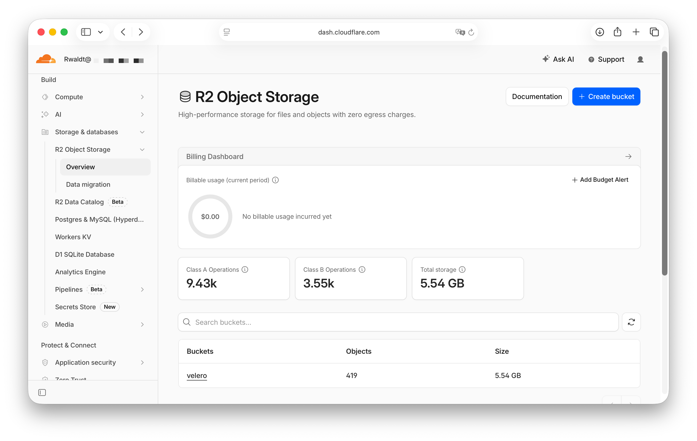

# Velero

## S3 Storage Backend

I started with Cloudflare's R2 Object Storage, which has a free tier with 10 GB. After 1 daily backup with a retention of 1 week, I had already used 5.54 GB, so I decided to pause the velero schedule until I've found an alternative.

I'm now looking at Garage (<https://garagehq.deuxfleurs.fr>) as an alternative.
